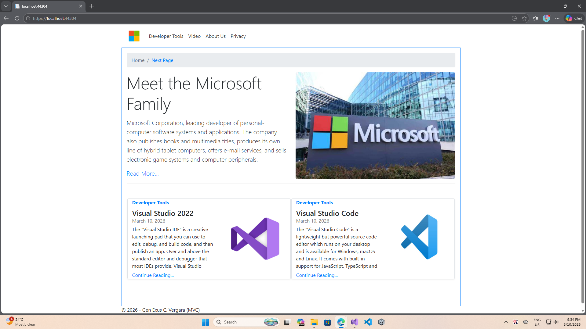
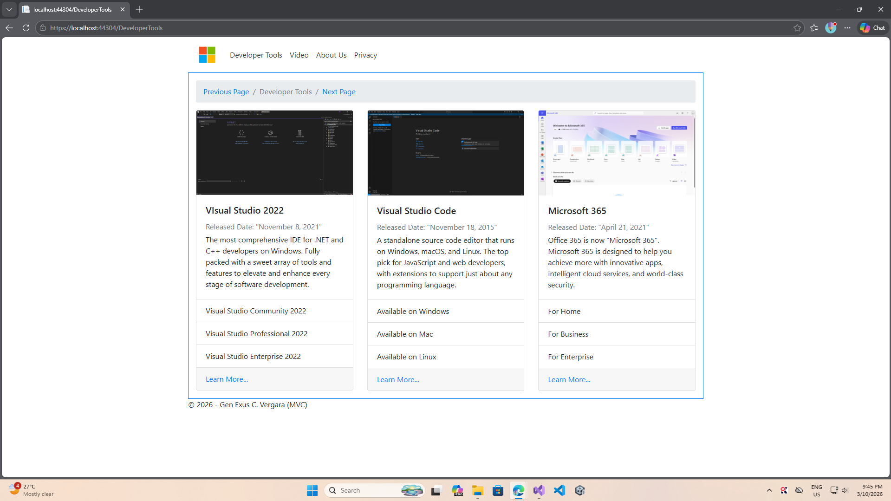
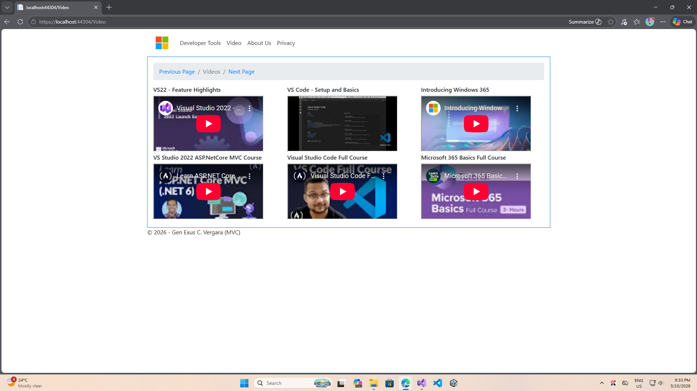

<h1 align="center">🚀 # MicrosoftSiteUsing_ASP.NET-MVC </h1>

 I recreated a Sample Microsoft UI site using ASP.NET-MVC

<table align="center">
  <tr>
    <td></td>
    <td></td>
    <td></td>
  </tr>
  </table>
